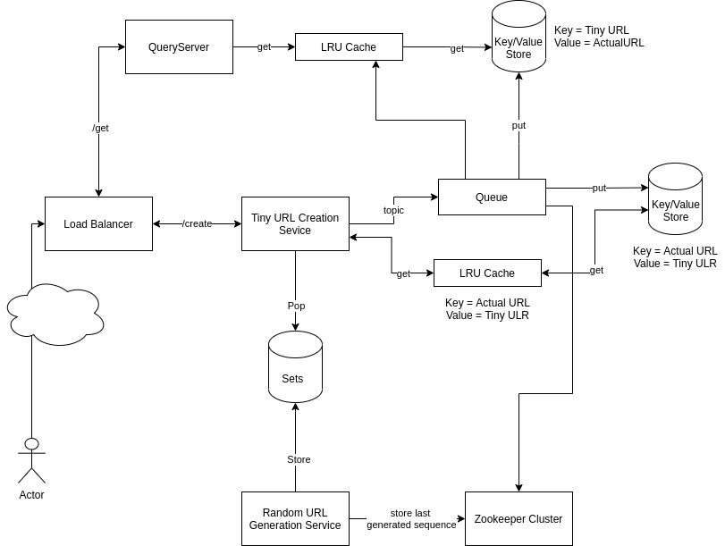

#Assumptions:
* Design is more focus in reducing latency.

#Still not answered
* What if user has created tiny url for url. Does not use for last 2 years(basically for long time) ?
* Attack
  * Continuously getting query for unknown tiny url
    * This we can have another service which handle this part
  * Bombarding the query from one server

#HLD Detail

##Services

###**Random Generation services**
Random generation services creates random number and pushed to distributed set which is utilised by creation services.
* Random is min 8 digit value contains A-Z,0-9.
* On Start up, Each random service picks digit/alphabets from which it starts generating value.
Ex: let's say service start picks value 'A'. So it will start generating value starting for A incrementally. A, AA, AB, AZ,...,A9,.....,A999999999. This service periodically push the value to set in batch.
* To avoid conflict in picking number or tracking generated numbers, 
all service instance connected with zookeeper. From zookeeper, all service keep in sync.
* Each service periodically writes last generated sequence in zookeeper before pushing values into distributed set.

###**Conversion Service**
Conversion service convert actual url into tiny url.
* On Receiving request, Conversion service pop from the distributed set and map to tiny url. 
* Created tiny URL put into distributed queue which is utilized by key-value store NoSQL DB. 
* Once service push the value into queue, service add the entry into distributed cache backed by key-value NoSQL DB, 
where key is actual URL and value is tiny URL.
* This cache will be used to avoid regeneration of tiny URL for received actual URL.

###**QueryService**
Query service provides actual URL for given tiny service.
* Query service uses cache backed by key-value NoSQL DB to fetch actual URL to tiny url.

## Storage:
###Tiny URL -> Actual URL (LRU Cache + Key-Value NoSQL DB)
Query service uses this storage to fetch actual ulr by providing tiny url. 

* Query service uses this storage in read-only mode only.
* On cache miss, Cache query to Key-Value NoSQL DB to fetch actual url. 
* It stores tiny URL created by conversion service to actual URL. 
* It uses queue to load data, so there is eventual consistency in storing data  
* Cache is LRU such that most frequently used key stored in cache.
 

###Actual URL -> Tiny URL (LRU Cache + Key-Value NoSQL DB)
Conversion service uses this DB to avoid regeneration of tiny ulr for actual url.

* DB instance store actual url received in request to tiny URL.
* It uses queue to load data, so there is eventual consistency in storing data
* We assume that recently created ULR can be queried again, so that FIFO queue can be useful here. 

### Distributed Set
Set is used by conversion service to pop generated randoms by tiny url generation service in batch.

* Set will ensure that one random can not be pop by multiple conversation service.

##Other Component

### Load Balancer
Load balancer has multiple responsibility.

* Route request to appropriate service.
* Load Balance requests between service instances.
* Timeout the request is response is not received within time limit.
* Does resend request required???

### Queue
Queue works as single source of truth. Both Key-Value NoSQL DB uses queue to populate data.

###  Zookeeper Cluster
Zookeeper cluster uses to communicate between cluster and store the state. 

* This cluster used by Queue if we use kafka
* Random Generation service uses kafka to 
  * store last generated random and use it during restart
  * If multiple service run, it will be used to pick different series of random 
  to avoid duplication of random

#FAQ

###**How does your system ensure that 2 URLs never map to the same shortened URL ?**

**A:** 

Allocating tiny url to actual url is responsibility of conversion service. Each service instance pop 
pre-generated random from distributed set. 
Distributed set ensure that same random does not allocate to two services. 

It can be possible that service instance pop pre-generated tiny URL from distributed set but restart before using it. 
In that case, tiny url is lost(does not allocate to any url).  

###**How will you ensure the system is very low latency ?**

**A:** This can be divided into multiple part.

####Creating Tiny URL 
Conversion service uses distributed in-memory set to fetch pre-generated tiny ULR to received URL. 
Service does not perform network call(pop) for every received request. 
Instead, It will perform batch pop operation to fetching bulk of tiny urls and store it in-memory for further use.

####Storing Tiny URL
Conversion service perform async call to key-value DB, 
Queue will be used to populate data into respective DB eventually.
i.e. Service stores actual URL and mapped tiny URL into queue, and it will eventually populate into key-value store.

####Checking tiny URL is already generated for received URL
LRU cached(backed by key-value store) will be used to check tiny URL is already generated for received URL. 
If tiny URL already generated for received URL then it will be sent in response.

####Handling latency during fetching actual URL from tiny URL operation
Generated tiny URL fetched for LRU cached(backed by key-value store) which ensure low latency.

###What will happen if the machine storing the ULR mapping dies ?
Replication is enabled in all DB, Cache and in queue, 
so that if any machine goes down service is not hamper and data does not loss.

###How do you ensure your system is consistent ?
DB support persistence storage, so once generated URL stored in DB, we can ensure that mapping never loss. 
Also, System will take periodic back of DB and Queue, so that if disk is corrupted or destroyed,
we can re-generate the DB state from back up or from queue.    

###How do you make sure that your service never goes down?
Service deploy as  active-active mode. Multiple instances of a service can be run simultaneously. 
Also, Services deployed on kubernetes cluster or AWS which support auto-scaling and auto-restart.   

