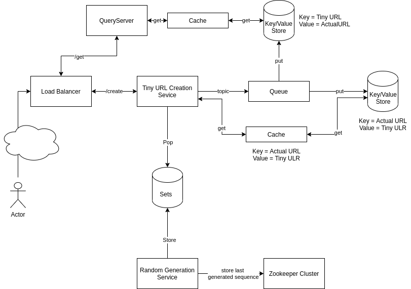

##Services:

###**Random Generation services**
* Random generation services creates random number and pushed to distributed set tobe utilised by creation services.
* Random is min 1 digit value contains A-Z,0-9.
* Random services instance communicated with zookeeper server and listen for events.
* On Start up, each random service picks digit/alphabets from which it starts generating value.Ex: let's say service start picks value 'A'. So it will start generating value starting for A incrementally. A, AA, AB, AZ,...,A9,.....,A999999999. This service periodically push the value to set in batch.
* To avoid conflict in picking starting number or tracking generated numbers, all service instance connected with zookeeper. From zookeepr, all service keep in sync.
* Each service periodically writes last generated sequence in zookeeper before pushing values into distributed set.

###**Conversion Service**
* Conversion service convert actual url into tiny url.
* On Receiving request, Conversion service pop from the distributed set and map to tiny url. 
* Created tiny URL put into distributed queue tobe utilized by key-value store NoSQL DB. 
* Once service push the value into queue, service add the entry into distributed cache backed by key-value NoSQL DB, 
where key is actual URL and value is tiny URL.
* This cache will be used to avoid regeneration of tiny URL for received actual URL.

###**QueryService**
* Query service is responsible to provide actual URL for given tiny service.
* Query service uses cache backed by key-value NoSQL DB to fetch actual URL to tiny url.